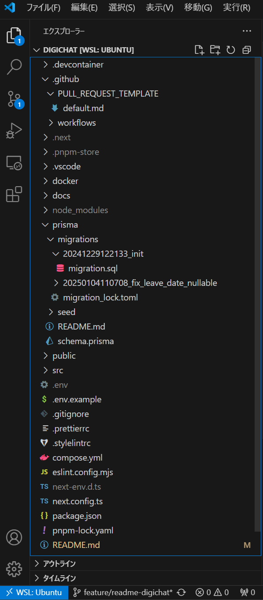

# digichat

芝浦工業大学デジクリのサークル内SNS「digichat」

## ドキュメント

|                    |                                              |
| ------------------ | -------------------------------------------- |
| 環境構築           | [docs/README.md](docs/README.md)             |
| 開発ルール         | [docs/CONTRIBUTING.md](docs/CONTRIBUTING.md) |
| 認証のセットアップ | [docs/AUTH_SETUP.md](docs/AUTH_SETUP.md)     |
| ADR                | [docs/ADR.md](docs/ADR.md)                   |
| Prismaの操作方法   | [prisma/README.md](prisma/README.md)         |
| データベース設計   | [prisma/ERD.md](prisma/ERD.md)               |

## 環境構築の手順

### .envの用意

`.env.example`をベースに`.env`を用意する。

```bash
cp .env.sample .env
```

### VSCodeでDevContainerを使用する場合

画面左下の青いところをクリック。


その後、`コンテナーで開く`を選択。しばらく待つとDevContainerが自動で立ち上がる。

### 依存関係のインストール

pnpmでインストールをする

```bash
pnpm install
```

### マイグレーション

データベースのマイグレーションを行う

```bash
pnpm prisma migrate dev
```

### seedデータの適用

マイグレーションが終わったらseedデータを適用する。

```bash
pnpm seed
```

詳細は `prisma/README.md` を参照。

### 開発サーバーの起動

devを実行することでサイトが表示される。

```bash
pnpm dev
```

実行後、`localhost:3000`で開発サーバーが起動する。`0.0.0.0:3000`だとGoogleのOAuth認証ができないので注意。

## 使用しているライブラリ

- TypeScript
- Next.js App Router
- Mantine
- ESLint
- Prettier
- Stylelint
