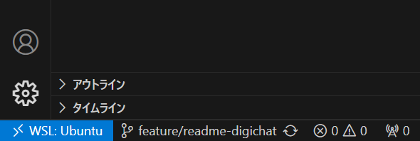

# digichat

This is a [Next.js](https://nextjs.org) project bootstrapped with [`create-next-app`](https://nextjs.org/docs/app/api-reference/cli/create-next-app).

## 環境設定の手順

### .envの用意

`.env.example`をベースに`.env`を用意する。

```bash
cp .env.sample .env
```

### VSCodeでDevContainerを使用する場合

画面左下の青いところをクリック。


その後、`コンテナーで開く`を選択。しばらく待つとDevContainerが自動で立ち上がる。

### 依存関係のインストール

pnpmでインストールをする

```bash
pnpm install
```

### マイグレーション

データベースのマイグレーションを行う

```bash
pnpm prisma migrate dev
```
### シートデータの生成

マイグレーションが終わったらシードデータを生成する

```bash
pnpm seed
```

### 開発サーバーの起動

最後にdevを実行することでサイトが表示される。

```bash
pnpm dev
```

実行後、`localhost:3000`で開発サーバーが起動する

## frontend dependencies

- TypeScript
- Next.js App Router
- Mantine
- ESLint
- Prettier
- Stylelint
