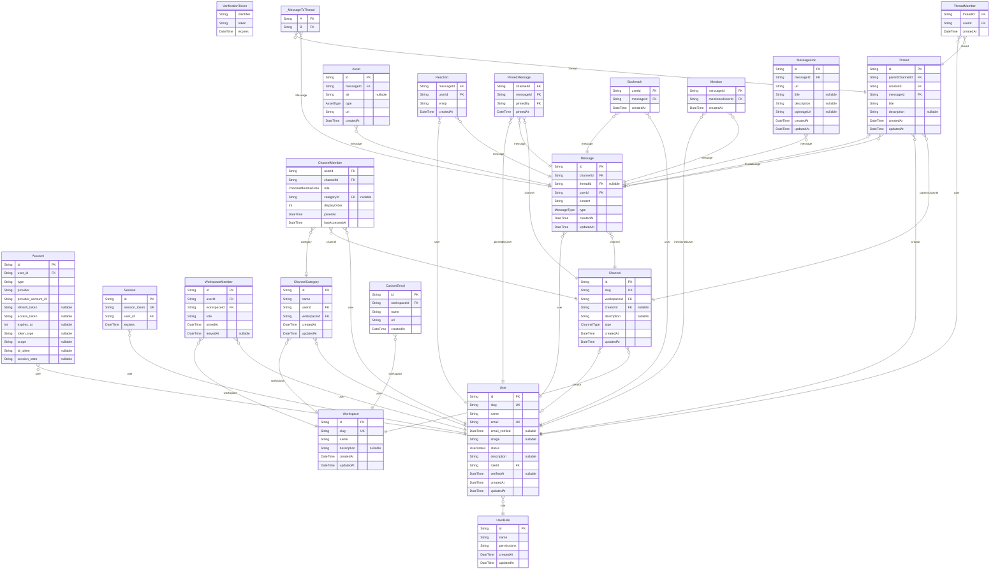

# ER Diagram
> Generated by [`prisma-markdown`](https://github.com/samchon/prisma-markdown)

- [default](#default)

## default

### `Account`
*
 * Google OAuthのアカウントを管理するテーブル。Auth.js用

**Properties**
  - `id`: 
  - `user_id`: 
  - `type`: 
  - `provider`: 
  - `provider_account_id`: 
  - `refresh_token`: 
  - `access_token`: 
  - `expires_at`: 
  - `token_type`: 
  - `scope`: 
  - `id_token`: 
  - `session_state`: 

### `Session`
*
 * ログインユーザーのセッションを管理するテーブル。Auth.js用

**Properties**
  - `id`: 
  - `session_token`: 
  - `user_id`: 
  - `expires`: 

### `VerificationToken`
*
 * Auth.js用

**Properties**
  - `identifier`: 
  - `token`: 
  - `expires`: 

### `User`
*
 * Digichatユーザーを管理するテーブル

**Properties**
  - `id`: 
  - `slug`: ユーザーが自由に設定できる一意なID
  - `name`: 表示名
  - `email`: 大学のGmailアカウント。sicなし
  - `email_verified`: 
  - `image`: アイコン画像のURL
  - `status`: オンライン状態
  - `description`: 自己紹介
  - `roleId`: 
  - `verifiedAt`: 
  - `createdAt`: 
  - `updatedAt`: 

### `UserRole`
*
 * ユーザーのロールを管理するテーブル。Discordのロールに相当する

**Properties**
  - `id`: 
  - `name`: 
  - `permissions`: 一旦ADMIN, MODERATOR, USERのいずれかを設定する。ADMINはインフラ部員、MODERATORは幹部
  - `createdAt`: 
  - `updatedAt`: 

### `Workspace`
*
 * ワークスペースを管理するテーブル

**Properties**
  - `id`: 
  - `slug`: 
  - `name`: 
  - `description`: 
  - `createdAt`: 
  - `updatedAt`: 

### `WorkspaceMember`

**Properties**
  - `id`: 
  - `userId`: ユーザーテーブルのユーザーと紐づける。同一のユーザーが複数のワークスペースに参加できる
  - `workspaceId`: 
  - `role`: 
  - `joinedAt`: 
  - `leavedAt`: 

### `Channel`

**Properties**
  - `id`: 自動生成されるID。URLにはこれを使用する
  - `slug`: ユーザーが直接目にするチャンネルの名前
  - `workspaceId`: 
  - `creatorId`: 
  - `description`: 
  - `type`: 
  - `createdAt`: 
  - `updatedAt`: 

### `Thread`

**Properties**
  - `id`: 
  - `parentChannelId`: 
  - `creatorId`: 
  - `messageId`: スレッドの最初のメッセージ
  - `title`: スレッドのタイトル。デフォルトは最初のメッセージとし、あとから変更可能
  - `description`: スレッドの説明。デフォルトはnullとし、あとから変更可能
  - `createdAt`: 
  - `updatedAt`: 

### `ThreadMember`
*
 * スレッドをフォロー中のユーザーを管理するテーブル。通知を送信する対象

**Properties**
  - `threadId`: 
  - `userId`: 
  - `createdAt`: 

### `ChannelMember`

**Properties**
  - `userId`: 
  - `channelId`: 
  - `role`: 
  - `categoryId`: 
  - `displayOrder`: フォルダ内の表示順。同じフォルダ内で並び順の入れ替えが発生したときに更新する
  - `joinedAt`: 
  - `lastAccessedAt`: チャンネルに最後にアクセスした日時。既読の管理に使用

### `ChannelCategory`
*
 * ユーザーが作成したフォルダを管理するテーブル

**Properties**
  - `id`: 
  - `name`: 
  - `userId`: 
  - `workspaceId`: 
  - `createdAt`: 
  - `updatedAt`: 

### `Message`

**Properties**
  - `id`: 
  - `channelId`: 
  - `threadId`: 
  - `userId`: 
  - `content`: 
  - `type`: 
  - `createdAt`: 
  - `updatedAt`: 

### `Asset`

**Properties**
  - `id`: 
  - `messageId`: 
  - `alt`: アセットの代替テキスト。画像の場合はalt属性に相当
  - `type`: 
  - `url`: 
  - `createdAt`: 

### `Reaction`

**Properties**
  - `messageId`: 
  - `userId`: 
  - `emoji`: 絵文字の名前。例えば:smile:や:heart:など。Unicodeの絵文字とカスタム絵文字で管理方法が異なるため、relationはつけない
  - `createdAt`: 

### `PinnedMessage`

**Properties**
  - `channelId`: 
  - `messageId`: 
  - `pinnedBy`: 
  - `pinnedAt`: 

### `Bookmark`
*
 * ユーザーが個人的にメッセージを保存しておくためのブックマーク機能に使用するテーブル

**Properties**
  - `userId`: 
  - `messageId`: 
  - `createdAt`: 

### `Mention`

**Properties**
  - `messageId`: 
  - `mentionedUserId`: 
  - `createdAt`: 

### `CustomEmoji`

**Properties**
  - `id`: 
  - `workspaceId`: 
  - `name`: 
  - `url`: 
  - `createdAt`: 

### `MessageLink`

**Properties**
  - `id`: 
  - `messageId`: 
  - `url`: 
  - `title`: 
  - `description`: 
  - `ogImageUrl`: 
  - `createdAt`: 
  - `updatedAt`: 

### `_MessageToThread`
Pair relationship table between [Message](#Message) and [Thread](#Thread)

**Properties**
  - `A`: 
  - `B`: 