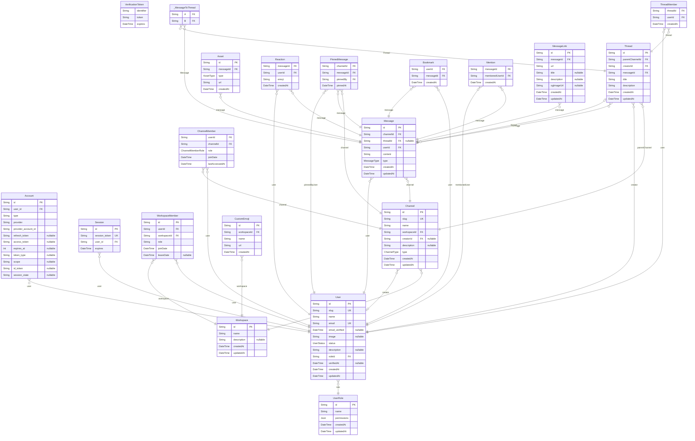

# TITLE
> Generated by [`prisma-markdown`](https://github.com/samchon/prisma-markdown)

- [default](#default)

## default

### `Account`

**Properties**
  - `id`: 
  - `user_id`: 
  - `type`: 
  - `provider`: 
  - `provider_account_id`: 
  - `refresh_token`: 
  - `access_token`: 
  - `expires_at`: 
  - `token_type`: 
  - `scope`: 
  - `id_token`: 
  - `session_state`: 

### `Session`

**Properties**
  - `id`: 
  - `session_token`: 
  - `user_id`: 
  - `expires`: 

### `VerificationToken`

**Properties**
  - `identifier`: 
  - `token`: 
  - `expires`: 

### `User`

**Properties**
  - `id`: 
  - `slug`: 
  - `name`: 
  - `email`: 
  - `email_verified`: 
  - `image`: 
  - `status`: 
  - `description`: 
  - `roleId`: 
  - `verifiedAt`: 
  - `createdAt`: 
  - `updatedAt`: 

### `UserRole`

**Properties**
  - `id`: 
  - `name`: 
  - `permissions`: 
  - `createdAt`: 
  - `updatedAt`: 

### `Workspace`

**Properties**
  - `id`: 
  - `name`: 
  - `description`: 
  - `createdAt`: 
  - `updatedAt`: 

### `WorkspaceMember`

**Properties**
  - `id`: 
  - `userId`: 
  - `workspaceId`: 
  - `role`: 
  - `joinDate`: 
  - `leaveDate`: 

### `Channel`

**Properties**
  - `id`: 
  - `slug`: 
  - `name`: 
  - `workspaceId`: 
  - `creatorId`: 
  - `description`: 
  - `type`: 
  - `createdAt`: 
  - `updatedAt`: 

### `Thread`

**Properties**
  - `id`: 
  - `parentChannelId`: 
  - `creatorId`: 
  - `messageId`: 
  - `title`: 
  - `description`: 
  - `createdAt`: 
  - `updatedAt`: 

### `ThreadMember`

**Properties**
  - `threadId`: 
  - `userId`: 
  - `createdAt`: 

### `ChannelMember`

**Properties**
  - `userId`: 
  - `channelId`: 
  - `role`: 
  - `joinDate`: 
  - `lastAccessedAt`: 

### `Message`

**Properties**
  - `id`: 
  - `channelId`: 
  - `threadId`: 
  - `userId`: 
  - `content`: 
  - `type`: 
  - `createdAt`: 
  - `updatedAt`: 

### `Asset`

**Properties**
  - `id`: 
  - `messageId`: 
  - `type`: 
  - `url`: 
  - `createdAt`: 

### `Reaction`

**Properties**
  - `messageId`: 
  - `userId`: 
  - `emoji`: 
  - `createdAt`: 

### `PinnedMessage`

**Properties**
  - `channelId`: 
  - `messageId`: 
  - `pinnedBy`: 
  - `pinnedAt`: 

### `Bookmark`

**Properties**
  - `userId`: 
  - `messageId`: 
  - `createdAt`: 

### `Mention`

**Properties**
  - `messageId`: 
  - `mentionedUserId`: 
  - `createdAt`: 

### `CustomEmoji`

**Properties**
  - `id`: 
  - `workspaceId`: 
  - `name`: 
  - `url`: 
  - `createdAt`: 

### `MessageLink`

**Properties**
  - `id`: 
  - `messageId`: 
  - `url`: 
  - `title`: 
  - `description`: 
  - `ogImageUrl`: 
  - `createdAt`: 
  - `updatedAt`: 

### `_MessageToThread`
Pair relationship table between [Message](#Message) and [Thread](#Thread)

**Properties**
  - `A`: 
  - `B`: 